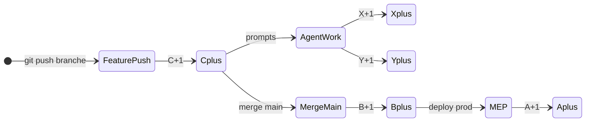

# Versionnement global A.B.C.X.Y

**Référence templates :** `C:\Dev\Project\REFERENCE\templates\`  
**Implémentation complète :** IDLE Isekai Chill

---

## Label

```
v{A}.{B}.{C}.{X}
v{A}.{B}.{C}.{X}.{Y}    (si Y > 0)
```

| Seg. | Événement | Stockage | Mécanisme |
|------|-----------|----------|-----------|
| **A** | MEP prod | `package.json` major | `npm run version:mep` — **manuel** |
| **B** | Push `main` | `package.json` minor | git `pre-push` auto |
| **C** | Push branche | `package.json` patch | git `pre-push` auto |
| **X** | Nouveau prompt | `build-revision.json` | hook Cursor |
| **Y** | Tâche agent | `build-revision.json` | hook Cursor `stop` |

Opt-out : `même X` / `même Y`.

---

## Deux vitesses

- **Release A/B/C** — git, humain/CI, livraison
- **Dev X/Y** — session agent, hooks Cursor

Compteurs qui montent vite = **normal** pour appli perso.

---

## Rituels agent

### C — clôture branche (pas chaque push)

DEV_LOG recap → validate/build → docs → normalisation → **move vers gitignore** (jamais delete ; purge = user manuel ou autre DD) → pipelines → commits atomiques → push.

### B — push main

**Go décideur obligatoire** → release gate → VERSION-INDEX + project-state → push.

**B ≠ MEP.**

### A — MEP

Agent **propose** procédure complète → `--dry-run` → go humain → bump → doc/tag/deploy.

Voir [mep-checklist.md](./mep-checklist.md).

### Kickoff

Nouvelle phase → [kickoff-nouvelle-phase.md](./kickoff-nouvelle-phase.md).

---

## Install

```bash
npm run hooks:install          # git pre-push A/B/C
# Copier templates/cursor → .cursor/
# Redémarrer Cursor, workspace trusted
```

Détail : [install-nouveau-projet.md](./install-nouveau-projet.md).

---

## Machine à états



---

## Anti-patterns

| ❌ | ✅ |
|----|-----|
| MEP auto | dry-run + validation humaine |
| Push main sans go | demander explicitement |
| Supprimer / vider archives | move → dossier **gitignore** ; purge = user |
| Deux agents writers | un writer / repo |
